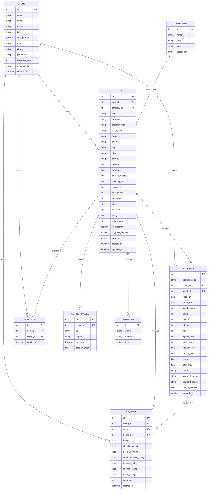

# Airbnb Web App - Fullstack Clone

A modern, pixel-perfect clone of the **Airbnb** web application built with **Next.js 14 (TypeScript)** on the frontend, **FastAPI (Python)** on the backend, and **SQLite (SQLAlchemy)** for relational persistence.

---

## 🌟 Key Features

### 1. Home & Explore
- **Grid of Listing Cards**: Photo carousels with smooth pagination dots, title, location, dynamic pricing per night, rating with star icons, and Superhost / Guest Favorite badges.
- **Search Bar**: Expandable modal search with destination suggestions (Italy, Japan, USA, France, Tropical), interactive dual-month date-range calendar, and guest counters (Adults, Children, Infants, Pets).
- **Category Filter Row**: Scrollable icon bar with 14 curated categories (Beachfront, Cabins, Mansions, OMG!, Tiny homes, Islands, Countryside, Lakefront, Skiing, Iconic cities, Luxe, Tropical, Amazing pools).
- **Filters Modal**: Price range sliders ($0–$1500+), type of place (Entire place, Room), bedroom/bed/bathroom counters, property amenities multi-select, and sorting (Recommended, Price low-to-high, Price high-to-low, Highest rated).
- **Interactive Map Toggle**: Floating *"Show map"* pill toggles an interactive Leaflet map with custom Airbnb price badges on pins that open preview cards on click.

### 2. Listing Detail Page
- **Photo Hero Grid**: Airbnb 5-photo grid layout with a full-screen photo gallery modal.
- **Stay Details**: Host info banner with avatar and Superhost badge, room highlights (self check-in, great location), sleeping arrangements with bed illustrations, and full amenities modal.
- **Availability Calendar**: Dual-month availability calendar showing booked dates disabled and real-time range selection.
- **Sticky Booking Widget**: Live itemized price breakdown (nightly rate × nights, cleaning fee, 14% service fee, 8% taxes) and date picker dropdown.
- **Reviews Breakdown**: Average rating, 6-category score bars (Cleanliness, Accuracy, Communication, Location, Check-in, Value), review cards, and *"Leave a review"* modal.
- **Location Map**: Centered Leaflet map showing the exact neighborhood.

### 3. End-to-End Booking Flow
- **Reservation Validation**: Prevents double-booking and validates max guest limits.
- **Confirm & Pay Checkout**: Trip details with date/guest review, payment method selector (Credit Card mock, Apple Pay, Google Pay, PayPal), message to host, and house rules acceptance.
- **Confirmation & Celebration**: Confetti animation, instant booking code generation (`HM-ABNB-XXXXXX`), and trip receipt modal.
- **"My Trips" (`/trips`)**: Manage bookings across tabs (Upcoming, Past Stays, Cancelled), reservation code lookup, date cancellation with instant calendar date release, and review writing for completed stays.

### 4. Host Experience (Full CRUD)
- **Host Dashboard (`/host`)**: Real-time revenue metrics, active listings count, incoming reservations count, and average rating.
- **Listings Management**: View all owned listings, toggle active visibility, edit listing (`/host/edit/[id]`), and delete listing with confirmation.
- **Multi-Step Listing Creation Wizard (`/host/create`)**:
  1. Category & property type selection
  2. Location details & address
  3. Capacity basics (guests, bedrooms, beds, bathrooms)
  4. Categorized amenities selection
  5. Photo management (add URLs & preview)
  6. Title, description, and pricing setup
- **Guest Reservations Management**: View all incoming bookings across host properties with guest profiles and payout details.

### 5. Airbnb Polish & User Switcher
- **Active Persona Switcher**: Seamlessly switch between guest persona (*Alex Morgan*) and host personas (*Elena Rostova - Superhost*, *Kenji Sato*, *Chloé Dubois*, *Mateo Rossi*) to test both perspectives without authentication friction.
- **Wishlists (`/wishlists`)**: Save and unsave favorite properties with optimistic heart button animations.
- **Custom Toast System**: Non-intrusive floating notifications.

---

## 🛠️ Tech Stack

| Layer | Technology |
|---|---|
| **Frontend Framework** | [Next.js 14](https://nextjs.org/) (App Router, React 18, TypeScript) |
| **Styling** | [Tailwind CSS](https://tailwindcss.com/) with authentic Airbnb design system |
| **Icons & UI** | [Lucide React](https://lucide.dev/), [canvas-confetti](https://www.npmjs.com/package/canvas-confetti) |
| **Maps** | [Leaflet](https://leafletjs.com/) with CartoDB Voyager tiles |
| **Date Utilities** | [date-fns](https://date-fns.org/) |
| **Backend Framework** | [FastAPI](https://fastapi.tiangolo.com/) (Python 3.11+) |
| **Database ORM** | [SQLAlchemy 2.0](https://www.sqlalchemy.org/) |
| **Database** | SQLite3 |
| **Validation** | [Pydantic v2](https://docs.pydantic.dev/) |
| **Server** | [Uvicorn](https://www.uvicorn.org/) |

---

## 📐 Database Schema



---

## 📡 API Overview

Base URL: `http://localhost:8000/api/v1` (Interactive Swagger Docs at `http://localhost:8000/docs`)

### Listings
- `GET /listings`: Search & filter listings by location, category, date range, guest capacity, price range, property type, amenities, and sorting.
- `GET /listings/{id}`: Detailed listing view with host profile, images, amenities, reviews, and booked date ranges.
- `POST /listings`: Create a new listing (Host).
- `PUT /listings/{id}`: Update an existing listing.
- `DELETE /listings/{id}`: Delete a listing.
- `POST /listings/calculate-price`: Dynamic calculation of base price, cleaning fee, service fee, taxes, and availability check.

### Bookings
- `POST /bookings`: Create a confirmed booking with strict date overlap validation.
- `GET /bookings/user/{user_id}`: Get all bookings made by a specific user.
- `GET /bookings/host/{host_id}`: Get all incoming reservations on properties owned by a host.
- `GET /bookings/{booking_id}`: Get reservation details.
- `PUT /bookings/{booking_id}/cancel`: Cancel a booking and release reserved dates.

### Reviews & Wishlists
- `POST /reviews`: Submit a rating and review (automatically updates listing average score).
- `GET /reviews/listing/{listing_id}`: Get reviews for a listing.
- `POST /wishlists/toggle`: Toggle saving a property to wishlist.
- `GET /wishlists/user/{user_id}`: Get all saved properties for a user.

### Metadata & Users
- `GET /categories`: List all categories.
- `GET /amenities`: List all amenities grouped by category.
- `GET /users`: List demo user personas.
- `POST /upload`: Upload property photos.

---

## 🚀 Getting Started

### Prerequisites
- **Node.js** (v18+ or v20+) and **npm**
- **Python** (v3.10+ or v3.11+)

### 1. Backend Setup

```bash
# Navigate to backend directory
cd backend

# Create and activate Python virtual environment
python3 -m venv venv
source venv/bin/activate  # On Windows: venv\Scripts\activate

# Install dependencies
pip install -r requirements.txt

# Seed the database with rich mock data
PYTHONPATH=. python app/seed.py

# Start the FastAPI server
PYTHONPATH=. uvicorn app.main:app --reload --port 8000
```
Backend API will be running at `http://localhost:8000` with Swagger docs at `http://localhost:8000/docs`.

### 2. Frontend Setup

```bash
# Navigate to frontend directory
cd frontend

# Install npm packages
npm install

# Start the Next.js development server
npm run dev
```
Open `http://localhost:3000` in your browser.

---

## 📦 Deployment Guide

### Deploy Backend (Render / Railway / Fly.io)
1. Push the repository to GitHub.
2. Create a new Web Service on Render / Railway pointing to the `backend/` directory.
3. Build command: `pip install -r requirements.txt`
4. Start command: `uvicorn app.main:app --host 0.0.0.0 --port $PORT`
5. The database auto-seeds on startup if empty.

### Deploy Frontend (Vercel)
1. Import the repository into Vercel and set the Root Directory to `frontend`.
2. Add Environment Variable:
   - `NEXT_PUBLIC_API_URL`: `https://your-backend-service.onrender.com/api/v1`
3. Click **Deploy**.

---

## 📄 License
This project is built for evaluation purposes as part of the SDE Fullstack Assignment. All trademarks and brand assets belong to their respective owners.
